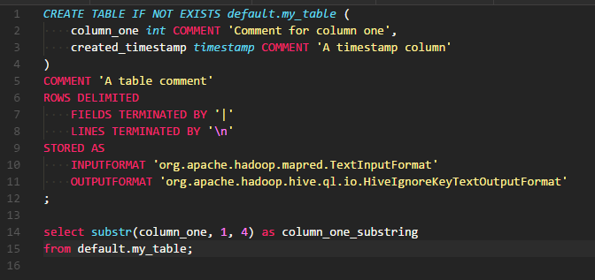

# hive-sql

This extension provides Hive SQL support for VSCode. It also provides some basic code snippets for operations such as creating a table, altering a table, or renaming columns.

The language specification is from the [hive-sublime-text](https://github.com/glinmac/hive-sublime-text) project, with slight modifications by me.

## Features

Enables syntax highlighting and formatting for Hive SQL, including user-defined functions. To enable the extension on your file, either name the file with a .hql, .q, or .ql extension, or press F1, type 'Change Language Mode', and then choose HiveSQL.

The screenshot below is using the wonderful [Monokai Dark Soda](https://marketplace.visualstudio.com/items?itemName=AdamCaviness.theme-monokai-dark-soda) theme. This is my first extension, and contributions are welcome, via GitHub.

## Release Notes

### 0.0.1

Initial release

### 0.0.2

Minor updates to packaging.
